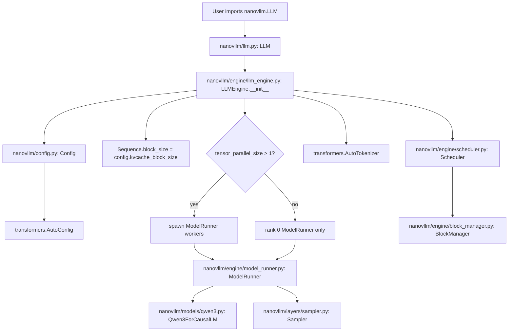
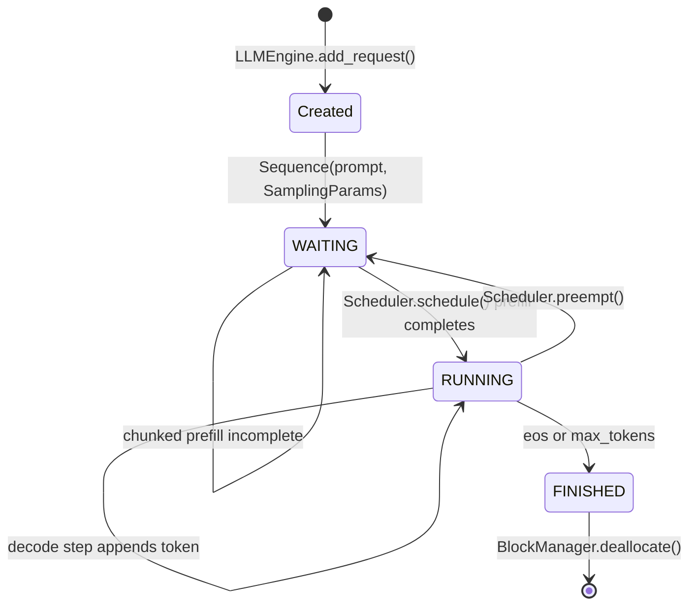
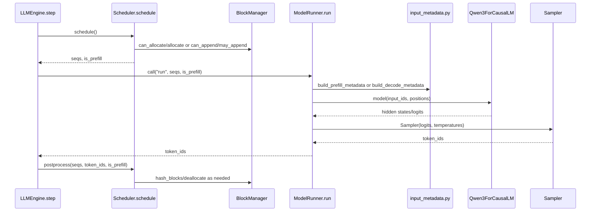
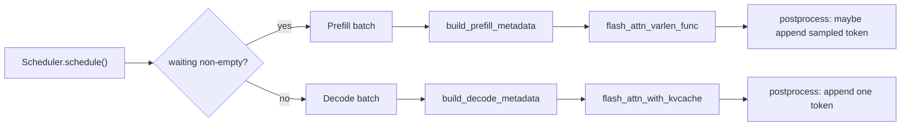
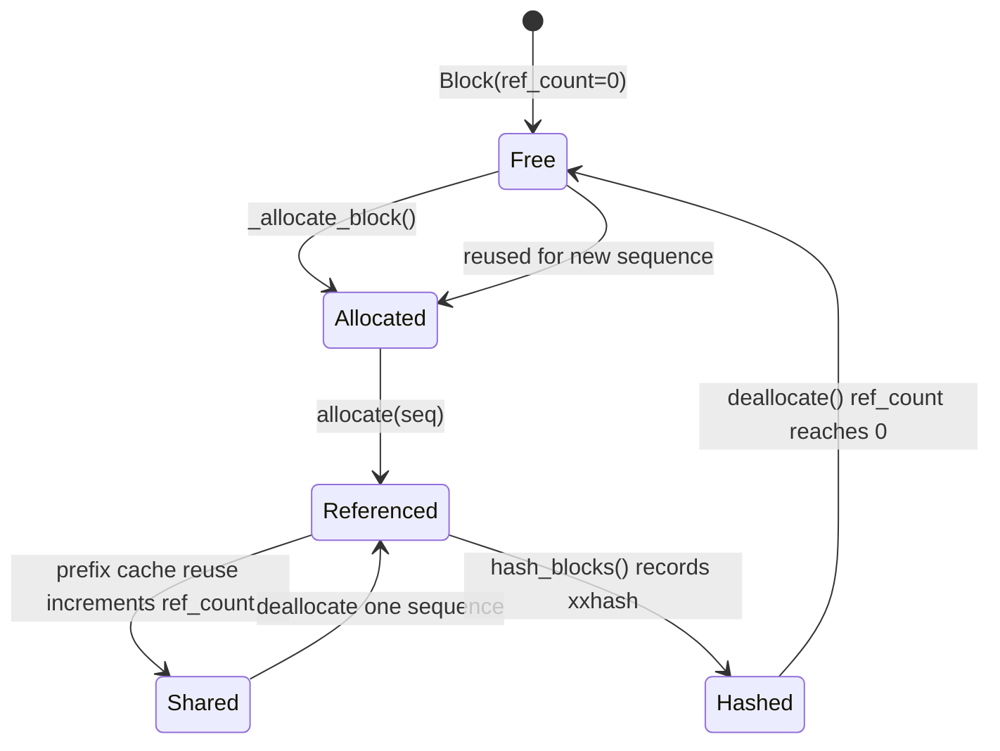
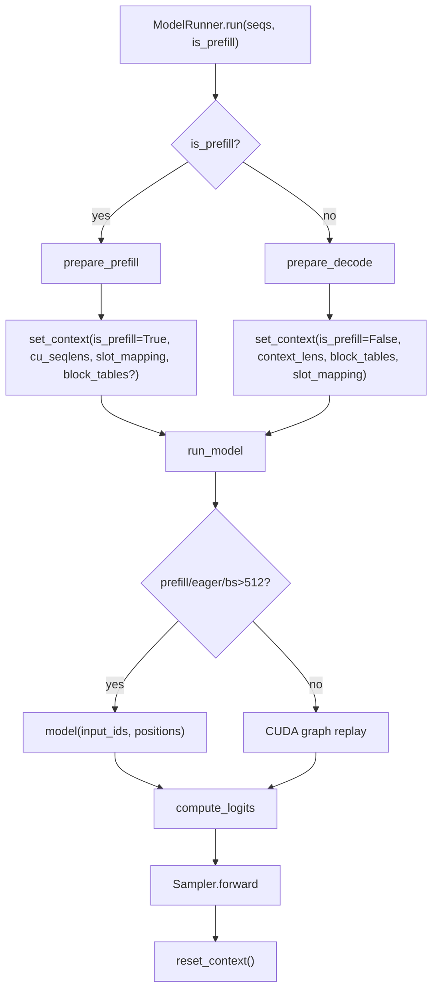

# nano-vLLM Architecture

This page maps the course implementation to the actual source tree. It is intentionally high level: use it to understand where data moves, then open the referenced files while implementing each TODO.

## Public Surface

The user-facing API is `nanovllm.LLM` and `nanovllm.SamplingParams`.

- `nanovllm/__init__.py` exports `LLM` and `SamplingParams`.
- `nanovllm/llm.py` defines `LLM` as a thin subclass of `nanovllm.engine.llm_engine.LLMEngine`.
- `nanovllm/sampling_params.py` defines `SamplingParams`; `temperature=0` is forbidden by assertion.
- `nanovllm/config.py` defines `Config`, with `kvcache_block_size=256` by default and an assertion that the configured block size is a multiple of 256. The course tests override `Sequence.block_size=4` for small examples.

## Engine Construction

`LLMEngine.__init__` owns process setup, tokenizer loading, the rank-0 `ModelRunner`, and the `Scheduler`. The `ModelRunner` owns the model, sampler, KV-cache tensor, CUDA graph capture, and tensor-parallel worker IPC.

## Request Lifecycle

The request state lives in `nanovllm/engine/sequence.py`. `SequenceStatus` has exactly `WAITING`, `RUNNING`, and `FINISHED`. Important fields are `token_ids`, `last_token`, `num_prompt_tokens`, `num_cached_tokens`, `num_scheduled_tokens`, `is_prefill`, and `block_table`.

## One Inference Iteration

`LLMEngine.step()` returns completed outputs plus a signed token count: positive for prefill throughput and negative for decode throughput.

## Prefill vs Decode

Prefill can schedule many prompt tokens per sequence and supports chunking. Decode schedules one token per running sequence. The scheduler always tries prefill first; decode only runs when no prefill batch was admitted.

## KV-Cache Block Lifecycle

`BlockManager` implements paged attention metadata, not tensor storage. It tracks physical block IDs, `free_block_ids`, `used_block_ids`, prefix hashes, and each `Block.ref_count`. Model tensor storage is allocated later in `ModelRunner.allocate_kv_cache()`.

Running example with educational `block_size=4`:

- Request A prompt `[10, 11, 12, 13, 14]` has logical blocks `[0, 1]`.
- Request B prompt `[20, 21, 22]` has logical blocks `[0]`.
- Example physical mapping: A `block_table=[7, 2]`, B `block_table=[5]`.
- A decode slot for the current last token is `physical_block=2`, `offset=0`, so `slot=2 * 4 + 0 = 8`.

## Model-Runner Execution Path

Attention reads `nanovllm.utils.context.get_context()` inside `nanovllm/layers/attention.py`. Prefill stores K/V into the cache with the Triton `store_kvcache` kernel and calls `flash_attn_varlen_func`. Decode calls `flash_attn_with_kvcache` using `context_lens` and `block_tables`.

## Tensor Parallel Overview

`ModelRunner` initializes NCCL with `dist.init_process_group("nccl", ...)`. Rank 0 communicates method calls to worker ranks through Python `SharedMemory` plus per-rank events. Layer sharding lives in `nanovllm/layers/linear.py`:

- `ColumnParallelLinear` loads an output-dimension shard and returns a partial output.
- `QKVParallelLinear` separately loads Q, K, and V shards into one packed projection.
- `RowParallelLinear` loads an input-dimension shard and uses `dist.all_reduce()` to combine partial outputs.
